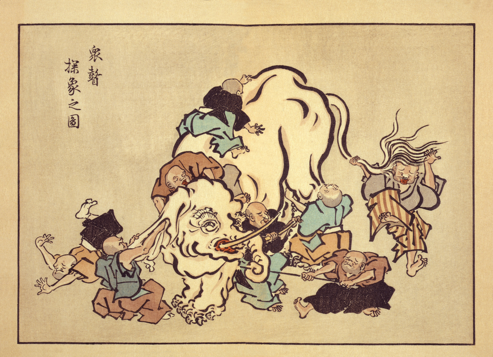

# Rodział I: Filozofia

Patrząc na Bitcoina powierzchownie, można by dojść do wniosku, że jest powolny, marnotrawny, niepotrzebnie nadmiarowy i zbyt paranoiczny. Przyglądając się Bitcoinowi dociekliwie, można odkryć, że rzeczy nie są takie, jak się wydają na pierwszy rzut oka.

Bitcoin ma sposób, by wziąć twoje założenia i wywrócić je do góry nogami.
Po pewnym czasie, kiedy już miałeś się rozluźnić, Bitcoin rozbije ścianę jak byk w składzie porcelany i po raz kolejny rozbije twoje założenia .

Bitcoin jest dzieckiem wielu dyscyplin. Jak ślepi mnisi badający słonia,
każdy, kto podchodzi do tej nowej technologii, robi to z innej perspektywy.
I każdy dojdzie do innych wniosków na temat natury bestii.

Poniższe lekcje dotyczą niektórych z moich założeń, które Bitcoin zburzył, oraz o wnioskach, do których doszedłem. Filozoficzne pytania o niezmienność, niedobór, lokalność i tożsamość są eksplorowane w pierwszych czterech lekcjach.

[Lekcja 1: Niezmienność i zmiana](01.html)

Lekcja 2: Niedobór niedostatku

Lekcja 3: Replikacja i lokalność

Lekcja 4: Problem tożsamości

Lekcja 5: Nieskazitelne poczęcie

Lekcja 6: Siła wolnego słowa

Lekcja 7: Granice wiedzy

Lekcja 5 odkrywa, że historia pochodzenia Bitcoina jest nie tylko fascynująca, ale
absolutnie niezbędna dla systemu bez liderów. Ostatnie dwie lekcje tego rozdziału  badają siłę wolności słowa i granice naszej indywidualnej wiedzy, odzwierciedlone przez zaskakującą głębokość Bitcoinowej króliczej nory.

Mam nadzieję, że świat Bitcoina będzie dla Ciebie równie edukacyjny, fascynujący i
rozrywkowy, jak jest dla mnie. Zapraszam Cię do podążania za białym królikiem i
zbadania głębi króliczej nory. Teraz złap swój kieszonkowy zegarek, skacz w dół i ciesz się spadaniem.
